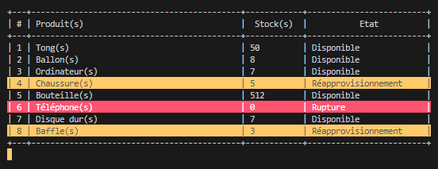

# Application Console C# pour la Gestion de Stock(s)

## Description

This application aims to realize classic operations on Stock Management.

## Installation

Choose corresponding [.NET 6.0 Framework](https://dotnet.microsoft.com/en-us/download) and install it on your computer.

## How to run project.

* Open your terminal, and navigate to the root path of the project. Type the following command: ```>dotnet run```
* To terminate the programme type ```>0``` in the terminal.

## Output

The image below is the output.



## Contributing

Pull requests are wellcome. For major changes, please open an issue first and discuss what you would like to change.